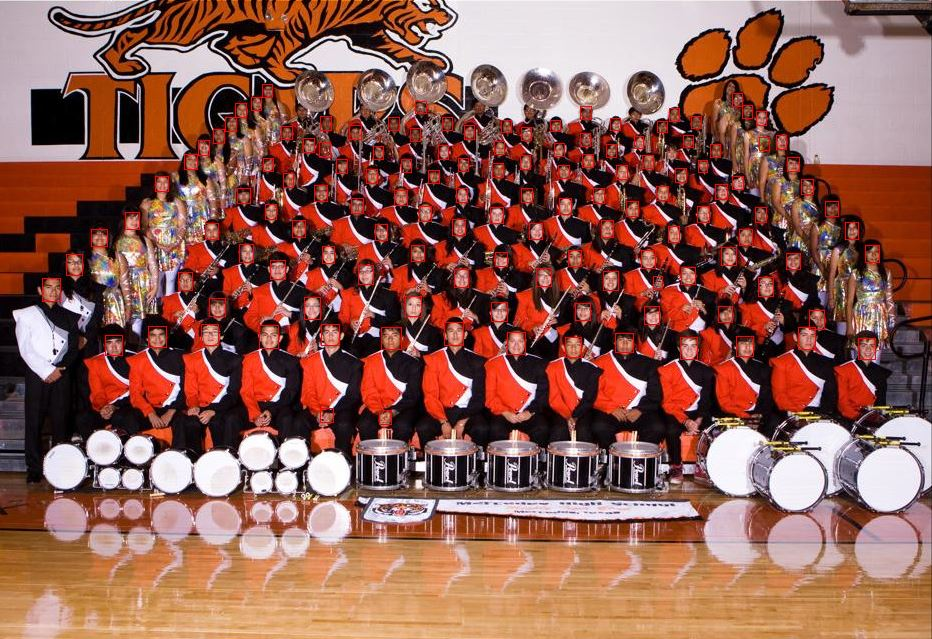

# RetinaFace: Single-shot Multi-level Face Localisation in the Wild

* **Author:** Barış Batuhan Topal
* **Contact:** barisbatuhantopal@gmail.com / baristopal20@ku.edu.tr

## Description

This project is an unofficial implementation of the paper "RetinaFace: Single-shot Multi-level Face Localisation in the Wild" in Julia programming language. 

**Abstract of the Paper:** Though tremendous strides have been made in uncontrolled face detection, accurate and efficient 2D face alignment and 3D face reconstruction in-the-wild remain an open challenge. In this paper, we present a novel single-shot, multi-level face localisation method, named RetinaFace, which unifies face box prediction, 2D facial landmark localisation and 3D vertices regression under one common target: point regression on the image plane. To fill the data gap, we manually annotated five facial landmarks on the WIDER FACE dataset and employed a semi-automatic annotation pipeline to generate 3D vertices for face images from the WIDER FACE, AFLW and FDDB datasets. Based on extra annotations, we propose a mutually beneficial regression target for 3D face reconstruction, that is predicting 3D vertices projected on the image plane constrained by a common 3D topology. The proposed 3D face reconstruction branch can be easily incorporated, without any optimisation difficulty, in parallel with the existing box and 2D landmark regression branches during joint training. Extensive experimental results show that RetinaFace can simultaneously achieve stable face detection, accurate 2D face alignment and robust 3D face reconstruction while being efficient through single-shot inference.

## Useful Links

* [**Paper Link**](https://openaccess.thecvf.com/content_CVPR_2020/papers/Deng_RetinaFace_Single-Shot_Multi-Level_Face_Localisation_in_the_Wild_CVPR_2020_paper.pdf)

* [**Research Log**](https://docs.google.com/document/d/1fF8Y2ZG3iQvLiHqBY47O8yGQFobWY9JDyNRvDlUqJPQ/edit?usp=sharing) 

* [**Final Presentation**](https://docs.google.com/presentation/d/1lBw68_IdbSe_0n2KAlupRnDulvfzNrUMwx3sBkNl9p8/edit?usp=sharing)

* [**Tech Report**](https://www.overleaf.com/read/pbtyskcsdgyt)

## Sample Result

## Requirements

* Julia >= v1.5.3 (latest is preferred)

* Knet >= v1.4.5 (latest is preferred)

* CUDA >= 11.0 (Optional: only required for running the code in GPU, latest is preferred)

## First Setup

* All the packages required to be installed are found under `setup.jl`. To install packages to you can directly run that source file (you can also type `make setup` to run it).

* To train or predict boxes and landmarks by using this repository, please initialize the parameters in `configs.jl` first. Especially please assign correct paths for the dataset directory.

* All the training, predicting and evaluating commands are available in the makefile. Please check that file before trying to run the code.

**Note:** In order to use the `make` command, the operating system should be a linux based distro or macOS. To use this command on Windows 10, please install [**GNU Make**](https://www.gnu.org/software/make/).

## Links

* [WIDERFACE](http://shuoyang1213.me/WIDERFACE/)

* [WIDERFACE Landmark Annotations](https://www.dropbox.com/s/7j70r3eeepe4r2g/retinaface_gt_v1.1.zip?dl=0)

* [AFLW](https://www.tugraz.at/institute/icg/research/team-bischof/lrs/downloads/aflw/) (not used in this project but used in the official paper)

* [FDDB](http://vis-www.cs.umass.edu/fddb/) (not used in this project but used in the official paper)

* [ImageNet Weights for ResNet50](https://www.vlfeat.org/matconvnet/models/imagenet-resnet-50-dag.mat)

* [Weights to Pretrained Models](https://drive.google.com/drive/folders/1GTyTgfmAG2BXvbDDy5n9Jv2ajv1IvWaw?usp=sharing)

**Note:** You can find the default parameters of each of the pretrained models in [**this file**](./weights/info.txt).

## Demonstration of the Network

## Progress So Far

* The entire training, predicting and AP evaluation pipelines are implemented. 

* An already pretrained model is created by loading the weights from the [**PyTorch implementation of this paper**](https://github.com/biubug6/Pytorch_Retinaface). 

* Cascaded structure of the model is also included to the model. The same context modules are used but the multitask heads are different for each cascaded structure.

* The model supports both implementations with 3 and 5 lateral connections. However, the only backbone available currently is ResNet50.

## Currently Working On

* Weights available in GitHub with 5 lateral connections are retrieved from intermediate results. A fully training process is running currently. 

## Results & Evaluation

Model | WIDER Easy AP | WIDER Medium AP | WIDER Hard AP | WIDER Whole Val. AP | WIDER Whole Val. mAP |
--- | --- | --- | --- |--- |--- |
Official Paper | 96.57 | 95.91 | 91.16 | - | - |
[Official Shared Sub-Model](https://github.com/deepinsight/insightface/tree/master/detection/RetinaFace) | 94.86 | 93.87 | 88.33 | - | - |
[PyTorch Weights Loaded](https://github.com/biubug6/Pytorch_Retinaface) | 95.48 | 94.04 | 84.43 | 93.14 | 62.24 |
*Cascaded_Lat5_Epoch13* | - | - | - | 82.29 | 44.08 |
*NoCascade_Lat5_Epoch20* | - | - | - | 83.08 | 48.16 |

Here, AP is calculated by taking the IOU threshold as 0.5 and mAP is calculated by taking the average of all IOU thresholds between 0.5 and 0.95 with step size of 0.05. Please keep in mind that Cascaded and NoCascade models are not fully trained yet.

**Note: ** If you just try to predict faces in images, please use the PyTorch weight-transferred model weights, since it is the most stable version right now.

## What To Do Next

* Support other datasets (FDDB and AFLW) in addition to the WIDERFACE dataset.

* Implement the other evaluation metrics: Area Under Curve (AUC), Failure Rate and Normalized Mean Error (NME).

* Instead of the normal Convolutional Layers in Context Modules, implement [**Deformable Convolutional Layers**](https://arxiv.org/abs/1703.06211) and retrain the model with this structure.

* Add different backbones for shorter processing times, such as MobileNet.

* Add multiple GPU support.

